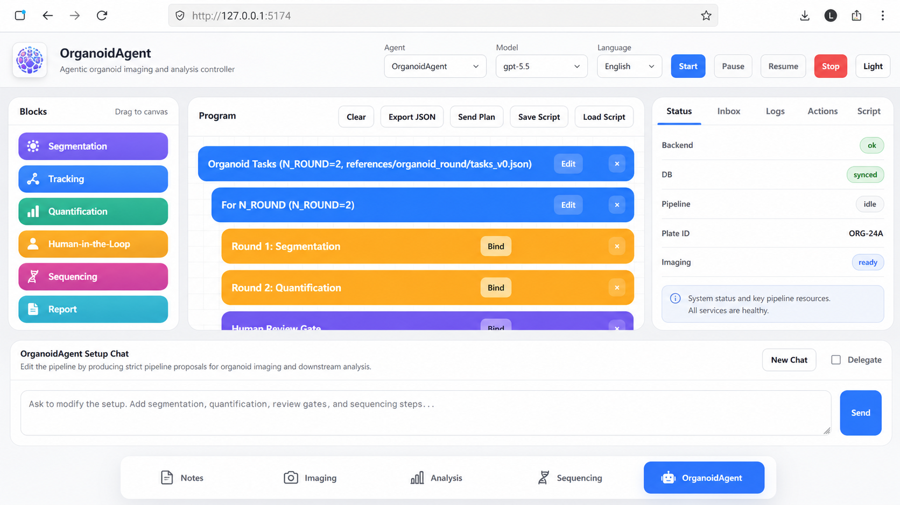

# OrganoidAgent


OrganoidAgent 是一个面向类器官图像与实验数据的本地优先智能分析平台。项目将数据管理、显微图像预览、类器官分割、形态学定量、荧光/活性预测和 Agent 工作流整合到同一个 Tornado + PWA 应用中。

> OrganoidAgent is a local-first platform for organoid image segmentation, morphology analysis, fluorescence-based viability prediction, dataset exploration, and agent-assisted workflows.



## 核心功能

| 模块 | 功能 |
| --- | --- |
| 类器官分割 | 使用 Cellpose 或 YOLO + SAM 对 TIFF 等显微图像进行实例分割，并保存掩膜、叠加图及质量证据 |
| 形态学分析 | 对面积、尺寸、边缘、曲率、中心性等形态指标进行批量计算，支持任务进度、取消和结果追踪 |
| 活性检测 | 通过 ConvNeXt-Tiny 模型预测类器官活性分数，并结合 YOLO + SAM 分割结果生成可解释的图像证据 |
| 批量报告 | 生成 `results.json`、`results.csv`、Markdown 报告、排序结果、掩膜、裁剪图和可视化叠加图 |
| 数据浏览 | 索引本地数据集，递归浏览文件，并预览 CSV、Excel、TIFF、常规图像、压缩包、GZip 和 AnnData `.h5ad` |
| Agent 工作流 | 提供会话、任务解析、Codex 作业、状态查询和结果管理接口，用于组织复杂分析流程 |
| PWA 界面 | 无大型前端框架，支持浏览器安装、离线静态资源缓存和本地分析交互 |

## 活性检测流程

活性检测模块位于 `fluorescence_prediction/`，处理流程如下：

```text
显微图像
   │
   ├─ YOLO：定位类器官
   ├─ SAM：生成精细分割掩膜
   ├─ 形态特征与质量控制
   └─ ConvNeXt-Tiny：预测活性分数（0–1）
                         │
                         └─ JSON / CSV / Markdown / 掩膜 / 叠加图
```

默认报告将预测结果分为：

- 高活性：`viability >= 0.8`
- 中活性：`0.6 <= viability < 0.8`
- 低活性：`viability < 0.6`

这些阈值用于结果汇总和排序，不应在未经实验验证的情况下直接解释为临床结论。

## 项目结构

```text
OrganoidAgent/
├── app.py                         # Tornado 后端、API 与 PWA 静态文件服务
├── web/                           # 主 PWA 前端
├── fluorescence_prediction/       # 分割、特征、活性模型、推理与报告
│   ├── SAM/                       # Segment Anything 实现
│   ├── segmentation.py            # YOLO + SAM 分割
│   ├── model.py                   # ConvNeXt-Tiny 活性预测模型
│   ├── inference.py               # 模型加载与单图推理
│   ├── features.py                # 形态和图像特征
│   ├── report.py                  # 批量报告生成
│   └── run.py                     # 活性检测命令行入口
├── differentiation_prediction/    # 分化与未来荧光表达研究工作流
├── analysis-tools/                # Cellpose、多尺度分割与实验分析脚本
├── scripts/                       # 环境检查、数据下载和推理入口
├── api-tests/                     # 分割 API 手动测试与复现脚本
├── BioAgent/                      # 相关 BioAgent 应用
├── BioAgentUtils/                 # 数据准备、训练和显微图像工具
├── config/workflows.json          # Agent/分析工作流配置
├── datasets/                      # 本地数据与缓存，不提交到 Git
├── analysis-outputs/              # 分析结果，不提交到 Git
├── references/                    # 方法、实验设计和研究文档
├── publication/                   # 论文图及可编辑素材
├── requirements.txt               # Web 与数据预览依赖
├── requirements-analysis.txt      # 分割、活性检测和训练依赖
└── environment.yml                # Conda 分析环境
```

## 环境要求

- Python 3.10+
- Conda 或 venv
- 推荐使用 NVIDIA GPU 运行分割和活性预测
- CPU 可以运行 Web 应用和数据预览，但模型推理会较慢

### 核心依赖

- Web/API：Tornado
- 数据与预览：NumPy、Pandas、AnnData、Pillow、tifffile
- 深度学习：PyTorch、TorchVision、Ultralytics
- 分割：Cellpose、Segment Anything
- 分析：SciPy、scikit-image、scikit-learn、Matplotlib、Seaborn

## 安装

克隆仓库：

```bash
git clone https://github.com/yhyh2270/OrganoidAgent.git
cd OrganoidAgent
```

推荐使用 Conda 创建完整分析环境：

```bash
conda env create -f environment.yml
conda activate organoid
```

只运行 Web 应用和数据预览时，也可以使用 pip：

```bash
python -m venv .venv

# Linux/macOS
source .venv/bin/activate

# Windows PowerShell
.venv\Scripts\Activate.ps1

python -m pip install -r requirements.txt
```

安装完整分析依赖：

```bash
python -m pip install -r requirements-analysis.txt
```

如果需要特定 CUDA 版本，请先按照 [PyTorch 官方安装说明](https://pytorch.org/get-started/locally/) 安装匹配的 `torch` 和 `torchvision`。

## 模型权重

模型权重体积较大，已被 `.gitignore` 排除，不包含在 GitHub 仓库中。运行完整活性检测前，请将相应权重放入：

```text
fluorescence_prediction/weights/
├── viability_best.pth             # 活性预测模型
├── yolo_organoid_best.pt          # 类器官检测模型
└── sam_vit_b_01ec64.pth           # SAM ViT-B 模型
```

使用环境检查脚本确认依赖和权重：

```bash
python scripts/check_environment.py --profile analysis
```

只检查 Web/预览环境：

```bash
python scripts/check_environment.py --profile core
```

## 启动 Web 应用

```bash
python app.py --port 8080
```

浏览器打开：

```text
http://localhost:8080
```

快速检查服务：

```bash
curl http://localhost:8080/api/datasets
curl http://localhost:8080/api/fluorescence/status
```

## 运行活性检测

### 单张图像

```bash
python scripts/run_fluorescence_prediction.py \
  --input datasets/example/image.tif \
  --output-dir analysis-outputs/fluorescence_prediction/single
```

### 批量处理目录

```bash
python scripts/run_fluorescence_prediction.py \
  --input datasets/example_batch \
  --output-dir analysis-outputs/fluorescence_prediction/batch \
  --order desc
```

Windows PowerShell 示例：

```powershell
python scripts/run_fluorescence_prediction.py `
  --input datasets\example_batch `
  --output-dir analysis-outputs\fluorescence_prediction\batch `
  --order desc
```

可通过环境变量指定独立的推理环境：

```bash
export ORGANOID_FLUORESCENCE_PYTHON=/absolute/path/to/python
```

```powershell
$env:ORGANOID_FLUORESCENCE_PYTHON = "C:\path\to\python.exe"
```

主要输出包括：

```text
output-dir/
├── results.json                    # 完整结构化结果
├── results.csv                     # 表格结果与活性排序
├── report.md                       # 自动分析报告
└── ...                             # 分割掩膜、叠加图、裁剪图和形态证据
```

## 形态学分割分析

Web 应用支持托管形态学任务，包括：

- 选择一张或多张 TIFF 图像
- 运行配置的多尺度 Cellpose 工作流
- 查询任务进度和日志
- 取消运行中的任务
- 浏览分割结果与定量证据

若 Cellpose 使用独立环境，可设置：

```bash
export ORGANOID_CELLPOSE_PYTHON=/absolute/path/to/python
```

```powershell
$env:ORGANOID_CELLPOSE_PYTHON = "C:\path\to\python.exe"
```

## 数据集与文件预览

将本地数据放入 `datasets/`。该目录以及生成的 `analysis-outputs/` 均不会提交到 Git。

支持的主要格式：

- 表格：CSV、TSV、XLS、XLSX
- 图像：TIFF、PNG、JPEG
- 分析对象：AnnData `.h5ad`
- 压缩数据：ZIP、TAR、TGZ、GZip 文本

可选数据下载：

```bash
python scripts/download_organoid_datasets.py
python scripts/download_drug_screening_datasets.py
```

## 主要 API

| 方法 | 路径 | 说明 |
| --- | --- | --- |
| `GET` | `/api/datasets` | 数据集列表与统计 |
| `GET` | `/api/datasets/{name}` | 数据集文件列表 |
| `GET` | `/api/preview?path=...` | 多格式文件预览 |
| `POST` | `/api/extract?path=...` | 解压数据包 |
| `GET` | `/api/fluorescence/status` | 活性检测环境与权重状态 |
| `GET` | `/api/fluorescence/images` | 可用于活性检测的图像 |
| `POST` | `/api/fluorescence/run` | 启动活性检测任务 |
| `POST` | `/api/morphology/run` | 启动形态学分割任务 |
| `GET` | `/api/morphology/status?id=...` | 查询形态学任务 |
| `POST` | `/api/morphology/cancel` | 取消形态学任务 |
| `GET` | `/api/agent/state` | Agent 与任务状态 |
| `POST` | `/api/agent/chat` | Agent 对话接口 |

## 开发与验证

目前项目以手动验证为主：

```bash
# 检查 Python 文件语法
python -m compileall -q app.py fluorescence_prediction scripts

# 启动应用
python app.py --port 8080

# 另一个终端检查 API
curl http://localhost:8080/api/datasets
curl http://localhost:8080/api/fluorescence/status
```

前端修改集中在 `web/app.js` 和 `web/styles.css`，后端路由及任务管理集中在 `app.py`。

## 注意事项

- 活性分数是模型预测结果，应结合实验对照、分割质量和独立生物学验证解释。
- 请勿将患者数据、实验隐私信息、数据库密码或 API 密钥提交到仓库。
- 大型原始数据、模型权重和分析输出应保存在 Git 忽略目录或外部对象存储中。
- 项目根目录目前没有 `LICENSE` 文件，因此复用和再分发条款尚未明确。

## 贡献

欢迎提交 Issue 或 Pull Request。建议：

1. 为单一功能创建独立分支。
2. 保持 Python 代码使用 4 空格缩进和 snake_case 命名。
3. 修改 UI 时附带截图。
4. 在 PR 中说明运行过的验证命令和模型/数据版本。

## Repository

https://github.com/yhyh2270/OrganoidAgent
